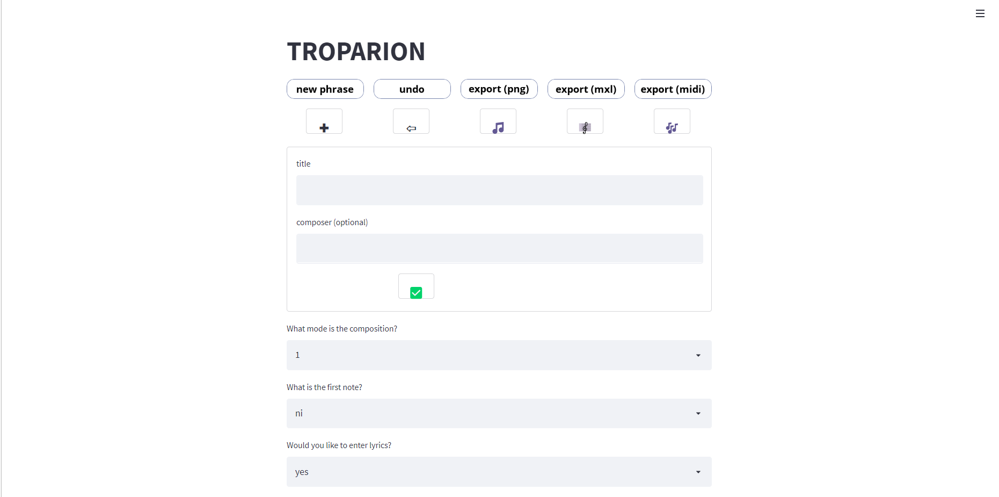
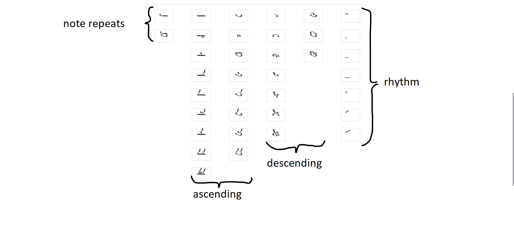

# TROP / TROPARION
#### **Tr**anscribing **O**rthodox **P**salmody / **A**nd **R**endering **I**t **On**line

## Goal
The Goal of this project is to create a python package (TROP) and a web application (TROPARION) to assist in the transcription of byzantine musical notation into modern western notation and midi. 

## Motivation
My hopes are to write a piece of software that is helpful to musicologists, novice performers, teachers and composers.

## Roadmap
1. planing/architectural design
2. build of a python package to handle the core functionality (fthore not yet implemented)
3. build of additional features for the web app
4. build of the web-app
5. deployment of the web-app

## Planned Features
#### Core Features
- textbased symbolic user input of byzantine notation 🗸 (TROP)
- rendered modern western notation output 🗸 (TROP)
- midi output 🗸

#### Additional Features
- ison notation on the western notation output
- rendered byzantine notation output 
- textbased syllabic user input of byzantine notation
- editable modern western notation output 🗸 
- microtonally tuned midi-output 
- lyrics input and output (Latin) 🗸
- lyrics input and output (Cyrillic) 🗸
- lyrics input and output (Greek) 🗸
 
#### Potential  Additional Features
- button based input 🗸 (TROPARION)
- modern western notation to byzantine notation transcription
- wysiwyg input
- lyrics input and output (Amharic)
- lyrics input and output (Arabic)
- lyrics input and output (Armenian)
- lyrics input and output (Coptic)
- lyrics input and output (Georgian)
- lyrics input and output (Hebrew)
- companion optical character recognition software

## Demo Video

## Known Issues
### image output
Unfortunatelly music21 is unable to write image-files, only display them. Attempts for enabling an image output within docker or running MuseScore within docker so far have not borne fruit. 

The solution is running the streamlit with MuseScore installed locally. 

The music21 setup issues, as described in the [TROP package](https://github.com/jaworiwanow/trop) still remain. 

### user input (mode and first note)
Beginning modes on certain notes (e.g.: first mode on ni) may lead to issues in the note generation.
To my knowledge those cases are irrelevant for transcription, as they do not appear in the repertoire, however more research will go into the matter and an error handling will be implemented eventually. 

## Documentation
A (in time to be improved) documentation of the package can be found [here](https://jaworiwanow.github.io/trop/trop.html)

Additionally, a documentation of the development approach can be found [here](https://jaworiwanow.github.io/troparion/intro.html).
## Screenshots

## Tutorials
Are available in the [wiki](https://github.com/jaworiwanow/troparion/wiki/tutorials).
